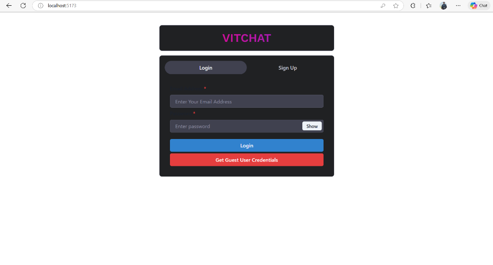
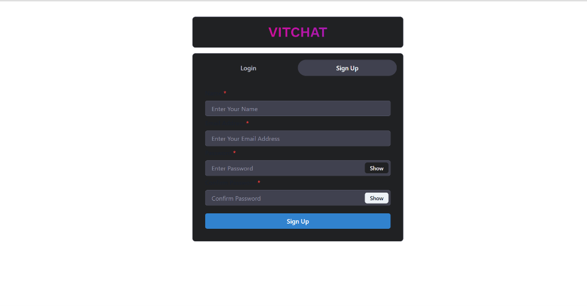
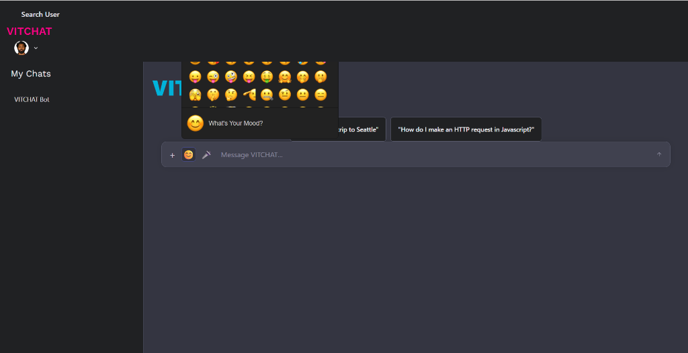
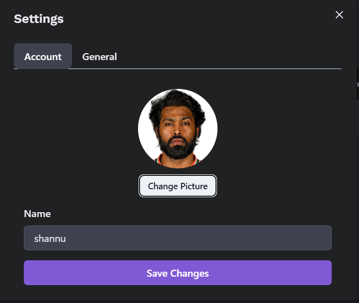

# VITCHAT 💬

A modern, feature-rich real-time chat application built with the MERN stack, featuring AI integration, voice notes, emoji picker, and online status indicators.


## ✨ Features

### 🤖 AI-Powered Chat
- **Smart Bot Integration**: Chat with an AI assistant powered by Google Gemini
- **Fuzzy Matching**: Falls back to custom training data for instant responses
- **Context-Aware**: Understands and responds to complex queries

### 💬 Real-Time Messaging
- **Instant Delivery**: Socket.IO powered real-time communication
- **Typing Indicators**: See when others are typing
- **Message History**: Persistent chat storage with MongoDB

### 🎤 Voice Notes
- **Record & Send**: One-click voice message recording
- **Audio Playback**: Built-in audio player for voice notes
- **WebM Support**: High-quality audio compression

### 😊 Emoji Picker
- **Rich Emoji Library**: Thousands of emojis at your fingertips
- **Dark Theme**: Seamlessly integrated with app design
- **Quick Insert**: Click to add emojis to messages

### 🟢 Online Status
- **Real-Time Presence**: See who's online instantly
- **Green Indicators**: Visual dots next to active users
- **Auto-Update**: Status syncs across all devices

### 📸 Image Sharing
- **Drag & Drop**: Easy image uploads
- **Preview**: Images render directly in chat
- **Local Storage**: Fast access to uploaded media

### 🎨 Modern UI/UX
- **Dark Mode**: Eye-friendly dark theme
- **Glassmorphism**: Premium frosted glass effects
- **Responsive Design**: Works on desktop, tablet, and mobile
- **Smooth Animations**: Polished micro-interactions

## 🛠️ Tech Stack

### Frontend
- **React** (v18.3.1) - UI library
- **Vite** (v6.0.5) - Build tool
- **Chakra UI** (v2.10.4) - Component library
- **Socket.IO Client** (v4.8.1) - Real-time communication
- **Axios** (v1.7.9) - HTTP client
- **React Router** (v7.1.1) - Navigation
- **emoji-picker-react** (v4.13.5) - Emoji selector

### Backend
- **Node.js** - Runtime environment
- **Express** (v4.21.2) - Web framework
- **MongoDB** - Database
- **Mongoose** (v8.9.3) - ODM
- **Socket.IO** (v4.8.1) - WebSocket server
- **JWT** (jsonwebtoken v9.0.2) - Authentication
- **bcryptjs** (v2.4.3) - Password hashing
- **Multer** (v1.4.5-lts.1) - File uploads
- **@google/generative-ai** (v0.21.0) - AI integration

## 📦 Installation

### Prerequisites
- Node.js (v14 or higher)
- MongoDB (local or Atlas)
- npm or yarn

### Clone Repository
```bash
git clone https://github.com/YOUR_USERNAME/VITCHAT.git
cd VITCHAT
```

### Backend Setup
```bash
cd server
npm install
```

Create a `.env` file in the `server` directory:
```env
PORT=5000
MONGO_URI=mongodb://localhost:27017/chatbot_mern
JWT_SECRET=your_jwt_secret_key
GEMINI_API_KEY=your_gemini_api_key_here
```

**Get a Gemini API Key:**
1. Visit [Google AI Studio](https://aistudio.google.com/app/apikey)
2. Click "Create API Key"
3. Copy and paste into `.env`

### Frontend Setup
```bash
cd ../client
npm install
```

### Run the Application

**Start Backend:**
```bash
cd server
npm run dev
```

**Start Frontend:**
```bash
cd client
npm run dev
```

The app will be available at:
- Frontend: `http://localhost:5173`
- Backend: `http://localhost:5000`

## 📸 Screenshots

### Login & Signup
<table>
  <tr>
    <td></td>
    <td></td>
  </tr>
</table>

### Main Chat Interface


### Emoji Picker in Action


### Settings & Profile Management


## 🚀 Deployment

### Backend (Render/Railway)
1. Push code to GitHub
2. Connect repository to Render/Railway
3. Add environment variables
4. Deploy

### Frontend (Vercel/Netlify)
1. Build the frontend: `npm run build`
2. Deploy the `dist` folder
3. Update API endpoints to production URL

## 📝 Environment Variables

| Variable | Description | Required |
|----------|-------------|----------|
| `PORT` | Server port | Yes |
| `MONGO_URI` | MongoDB connection string | Yes |
| `JWT_SECRET` | Secret for JWT tokens | Yes |
| `GEMINI_API_KEY` | Google Gemini API key | Optional* |

*Without Gemini key, the bot uses fuzzy matching with training data.

## 🤝 Contributing

Contributions are welcome! Please feel free to submit a Pull Request.

## 📄 License

This project is licensed under the MIT License.

## 👨‍💻 Author

**Your Name**
- GitHub: [@YOUR_USERNAME](https://github.com/YOUR_USERNAME)

## 🙏 Acknowledgments

- Google Gemini for AI capabilities
- Chakra UI for beautiful components
- Socket.IO for real-time magic

---

**Made with ❤️ using MERN Stack**
